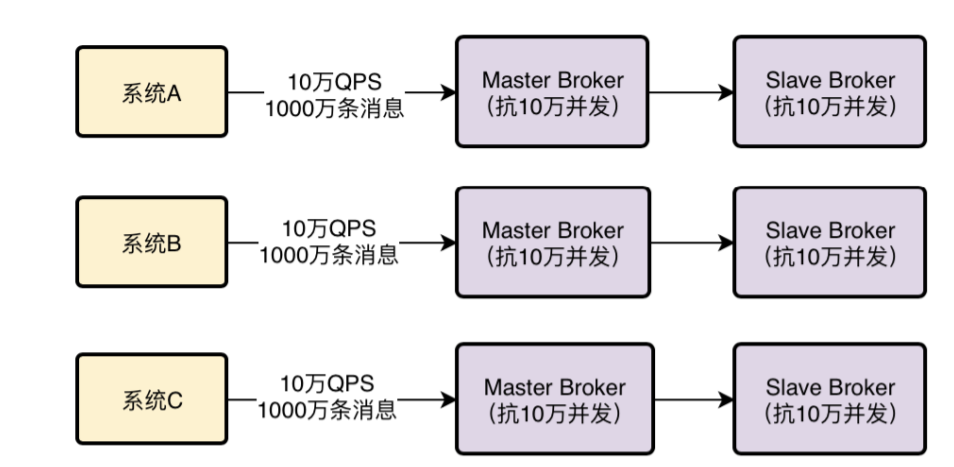

# mysql优化
## 聚集索引和非聚集索引
- 聚集索引一个表只能有一个，而非聚集索引一个表可以存在多个 
- 聚集索引存储记录是物理上连续存在，而非聚集索引是逻辑上的连续，物理存储并不连续
- 聚集索引:物理存储按照索引排序；聚集索引是一种索引组织形式，索引的键值逻辑顺序决定了表数据行的物理存储顺序。
  非聚集索引:物理存储不按照索引排序；非聚集索引则就是普通索引，仅仅只是对数据列创建相应的索引，不影响整个表的物理存储顺序。
- 聚簇索引：索引的叶节点就是数据节点。而非聚簇索引的叶节点仍然是索引节点，只不过有一个指针指向对应的数据块。

## mysql的myisam和innodb区别
- 索引结构
    InnoDB的数据文件本身就是主索引文件
    MyISAM的主索引和数据是分开的
    InnoDB的辅助索引data域存储相应记录主键的值而不是地址
    MyISAM的辅助索引和主索引没有多大区别
    InnoDB是聚簇索引，数据挂在逐渐索引之下
- 锁
    myisam 只支持表锁
    innodb 支持行锁
- 事务
    myisam 没有事务和mvcc
    innodb 支持事务和mvcc
- 主键
    MyISAM允许没有任何索引和主键的表存在，索引都是保存行的地址
    InnoDB如果没有设定主键或非空唯一索引，就会自动生成一个6字节的主键，数据是主索引的一部分，附加索引保存的是主索引的值
- 外键
    MyISAM不支持，InnoDB支持
  
## b-tree和b+tree

一棵m阶的B-Tree有如下特性：
    1. 每个节点最多有m个孩子。
    2. 除了根节点和叶子节点外，其它每个节点至少有Ceil(m/2)个孩子。
    3. 若根节点不是叶子节点，则至少有2个孩子
    4. 所有叶子节点都在同一层，且不包含其它关键字信息
    5. 每个非终端节点包含n个关键字信息（P0,P1,…Pn, k1,…kn）
    6. 关键字的个数n满足：ceil(m/2)-1 <= n <= m-1
    7. ki(i=1,…n)为关键字，且关键字升序排序。
    8. Pi(i=1,…n)为指向子树根节点的指针。P(i-1)指向的子树的所有节点关键字均小于ki，但都大于k(i-1)

每个节点占用一个盘块的磁盘空间，一个节点上有两个升序排序的关键字和三个指向子树根节点的指针，指针存储的是子节点所在磁盘块的地址。两个关键词划分成的三个范围域对应三个指针指向的子树的数据的范围域。以根节点为例，关键字为17和35，P1指针指向的子树的数据范围为小于17，P2指针指向的子树的数据范围为17~35，P3指针指向的子树的数据范围为大于35。

模拟查找关键字29的过程：
    1. 根据根节点找到磁盘块1，读入内存。【磁盘I/O操作第1次】
    2. 比较关键字29在区间（17,35），找到磁盘块1的指针P2。
    3. 根据P2指针找到磁盘块3，读入内存。【磁盘I/O操作第2次】
    4. 比较关键字29在区间（26,30），找到磁盘块3的指针P2。
    5. 根据P2指针找到磁盘块8，读入内存。【磁盘I/O操作第3次】
    6. 在磁盘块8中的关键字列表中找到关键字29。

B+Tree是在B-Tree基础上的一种优化，使其更适合实现外存储索引结构，InnoDB存储引擎就是用B+Tree实现其索引结构。
B+Tree相对于B-Tree有几点不同：
    1. 非叶子节点只存储键值信息。
    2. 所有叶子节点之间都有一个链指针。
    3. 数据记录都存放在叶子节点中。“”

推算：
    InnoDB存储引擎中页的大小为16KB，一般表的主键类型为INT（占用4个字节）或BIGINT（占用8个字节），指针类型也一般为4或8个字节，也就是说一个页（B+Tree中的一个节点）中大概存储16KB/(8B+8B)=1K个键值（因为是估值，为方便计算，这里的K取值为〖10〗^3）。
    也就是说一个深度为3的B+Tree索引可以维护10^3 * 10^3 * 10^3 = 10亿 条记录。
    实际情况中每个节点可能不能填充满，因此在数据库中，B+Tree的高度一般都在2-4层。
    mysql的InnoDB存储引擎在设计时是将根节点常驻内存的，也就是说查找某一键值的行记录时最多只需要1~3次磁盘I/O操作。

## 调优
### 为什么推荐建表时字段为not null?

- 通常情况下最好指定列为NOT NULL，除非真的需要存储NULL值。
    - 如果查询中包含可为NULL的列，对MySql来说更难优化，因为可为NULL的列使得索引、索引统计和值比较都更复杂。
    - 可为NULL的列会使用更多的存储空间，在MySql里也需要特殊处理。当可为NULL的列被索引时，每个索引记录需要一个额外的字节，在MyISAM里甚至还可能导致固定大小的索引（例如只有一个整数列的索引）变成可变大小的索引。
    - 通常把可为NULL的列改为NOT NULL带来的性能提升比较小，所以（调优时）没有必要首先在现有schema中查找并修改掉这种情况，除非确定这会导致问题。
    - 如果计划在列上建索引，就应该尽量避免设计成可为NULL的列。

- mysql的默认值

对于MySql而言，如果不主动设置为NOT NULL的话，那么插入数据的时候默认值就是NULL。NULL和NOT NULL使用的空值代表的含义是不一样，NULL可以认为这一列的值是未知的，空值则可以认为我们知道这个值，只不过他是空的而已。举个例子，一张表中的某一条name字段是NULL，我们可以认为不知道名字是什么，反之如果是空字符串则可以认为我们知道没有名字，他就是一个空值。而对于大多数程序的情况而言，没有什么特殊需要非要字段要NULL的吧，NULL值反而会对程序造成比如空指针的问题。

默认值为NULL带来的问题

- 聚合函数不准确
    对于NULL值的列，使用聚合函数的时候会忽略NULL值。例如：有一张表，name字段默认是NULL，此时对name进行count得出的结果是1，这个是错误的。count(*)是对表中的行数进行统计，count(name)则是对表中非NULL的列进行统计。

- =失效
    对于NULL值的列，是不能使用=表达式进行判断的，下面对name的查询是不成立的，必须使用is NULL。

- 与其他值运算
    NULL和其他任何值进行运算都是NULL，包括表达式的值也是NULL。user表第二条记录age是NULL，所以+1之后还是NULL，name是NULL，进行concat运算之后结果还是NULL。

- distinct、group by、order by
    对于distinct和group by来说，所有的NULL值都会被视为相等，对于order by来说升序NULL会排在最前。

- 索引问题
    - 官方文档：使用is NULL和范围查询都是可以和正常一样使用索引的，只不过在某些场景下，由于mysql的执行策略导致索引失效。
    - sql执行过程中，到优化器阶段，会选择使用什么索引比较合理，sql具体执行方案在这里确定下来，索引列存在NULL就会导致优化器在做索引选择的时候更复杂，更加难以优化。

### 排序优化
- MySQL支持两种方式的排序filesort和index，Using index是指MySQL扫描索引本身完成排序。index效率高，filesort效率低。
    - order by满足两种情况会使用Using index。
        - order by语句使用索引最左前列。
        - 使用where子句与order by子句条件列组合满足索引最左前列。 
    - 尽量在索引列上完成排序，遵循索引建立(索引创建的顺序)时的最左前缀法则。
    - 如果order by的条件不在索引列上，就会产生Using filesort。
    - 能用覆盖索引尽量用覆盖索引
    - group by与order by很类似，其实质是先排序后分组，遵照索引创建顺序的最左前缀法则。对于group by的优化如果不需要排序的可以加上order by null禁止排序。注意，where高于having，能写在where中 的限定条件就不要去having限定了。

- Using filesort文件排序原理详解 filesort文件排序方式
    - 单路排序:是一次性取出满足条件行的所有字段，然后在sort buffer中进行排序;用trace工具可 以看到sort_mode信息里显示< sort_key, additional_fields >或者< sort_key, packed_additional_fields >
   
    - 双路排序(回表排序模式):是首先根据相应的条件取出相应的排序字段和可以直接定位行数据的行 ID，然后在 sort buffer 中进行排序，排序完后需要再次取回其它需要的字段;用trace工具 可以看到sort_mode信息里显示< sort_key, rowid >

    - MySQL 通过比较系统变量 max_length_for_sort_data(默认1024字节) 的大小和需要查询的字段总大小来 判断使用哪种排序模式。如果 max_length_for_sort_data 比查询字段的总长度大，那么使用 单路排序模式; 如果 max_length_for_sort_data 比查询字段的总长度小，那么使用 双路排序模式。

例如：select * from a_table where b = '111' order by c; 注：字段b建立索引，字段c无索引
- 单路排序:
    1. 索引b找到第一个满足 b = '111' 条件的主键id 
    2. 根据主键 id 取出整行，取出所有字段的值，存入 sort_buffer 中 
    3. 从索引b找到下一个满足 b = '111' 条件的主键 id 
    4. 重复步骤 2、3 直到不满足  b = '111' 
    5. 对 sort_buffer 中的数据按照字段 c 进行排序
    6. 返回结果给客户端
- 双路排序: set max_length_for_sort_data = 10; ‐‐设置表所有字段长度总和肯定大于10字节
    1. 从索引 b 找到第一个满足 b = '111' 的主键id
    2. 根据主键 id 取出整行，把排序字段 c 和主键 id 这两个字段放到 sort buffer 中 
    3. 从索引 b 取下一个满足 b = '111' 记录的主键 id
    4. 重复 3、4 直到不满足 b = ‘111’
    5. 对 sort_buffer 中的字段 c 和主键 id 按照字段 c 进行排序
    6. 遍历排序好的 id 和字段 c，按照 id 的值回到原表中取出 所有字段的值返回给客户端
