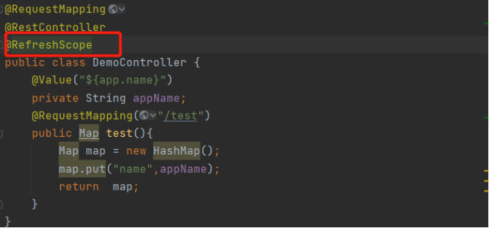
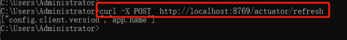
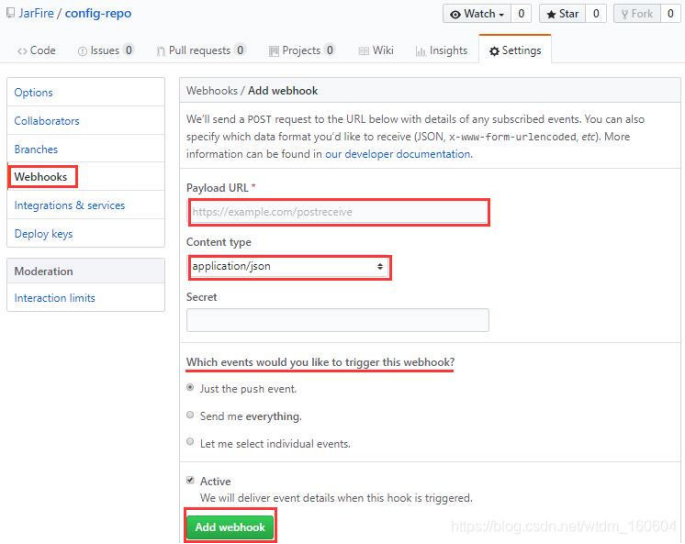
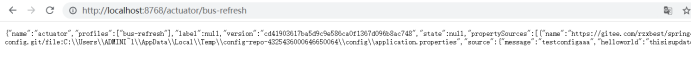

#config

## Config server
### 添加依赖
```
<dependency>
<groupId>org.springframework.cloud</groupId>
<artifactId>spring-cloud-config-server</artifactId>
</dependency>
<dependency>
<groupId>org.springframework.cloud</groupId>
<artifactId>spring-cloud-starter-netflix-eureka-client</artifactId>
</dependency>
```
### Application.properties配置
```
spring.cloud.config.server.git.uri=https://gitee.com/rzxbest/springcloud-config.git
spring.cloud.config.server.git.username=********
spring.cloud.config.server.git.password=********
spring.cloud.config.server.git.search-paths=config
spring.cloud.config.server.default-label=master

eureka.instance.hostname=localhost
eureka.client.registerWithEureka=true
eureka.client.fetchRegistry=true
eureka.client.serviceUrl.defaultZone:http://${eureka.instance.hostname}:8761/eureka/
```

## 访问配置文件
### 访问配置信息的URL与配置文件的映射关系如下所示：
- /{ application } / {profile} [/{label}]
- /{ application }-{profile}. yml
- /{ label }/{ application }-{profile}.yml
- /{ application }-{profile}.properties
- /{ label }/{ application }-{profile}.properties
上面的 url 会映射 {application}-{profile} .properties 对应的配置文件，其中 {label} 对应Git上不同的分支，默认为 master 。我们可以尝试构造不同的 url 来访问不同的配置内容， 例如：http://localhost:8888/{applicationName}/{profile}/{label} , label分支，不传的话默认master。

## Config client
### 添加依赖
```
<dependency>
<groupId>org.springframework.cloud</groupId>
<artifactId>spring-cloud-starter-config</artifactId>
</dependency>
<dependency>
<groupId>org.springframework.cloud</groupId>
<artifactId>spring-cloud-starter-netflix-eureka-client</artifactId>
</dependency>
```

### 添加配置 bootstrap.properties
server.port=8769
```
spring.application.name=CLOUD-CONFIG-CLIENT
eureka.instance.hostname=localhost
eureka.client.registerWithEureka=true
eureka.client.fetchRegistry=true
eureka.client.serviceUrl.defaultZone:http://${eureka.instance.hostname}:8761/eureka/
spring.cloud.config.profile=dev
spring.cloud.config.name=client-app
spring.cloud.config.discovery.serviceId=CLOUD-CONFIG-SERVER
spring.cloud.config.discovery.enabled=true
```


## 配置刷新
### 手动调用config-client的refresh接口
- 添加依赖
```
<dependency>
    <groupId>org.springframework.boot</groupId>
    <artifactId>spring-boot-starter-actuator</artifactId>
    <version>2.6.3</version>
</dependency>
```
- 添加配置
```
management.endpoints.web.exposure.include=refresh
management.endpoints.web.discovery.enabled=true
```

- 需用使用配置的类加@RefreshScope 
  
- Post请求接口
  

## 自动刷新,利用git webhook
  - 安装rabbitmq
  - configserver添加依赖
    ```    
    <dependency>
    <groupId>org.springframework.boot</groupId>
    <artifactId>spring-boot-starter-actuator</artifactId>
    <version>2.6.3</version>
    </dependency>
    
    <dependency>
        <groupId>org.springframework.cloud</groupId>
        <artifactId>spring-cloud-starter-bus-amqp</artifactId>
    </dependency>
    ```
      
  - configserver添加配置
    ```
    spring.rabbitmq.host=localhost
    spring.rabbitmq.port=5672
    spring.rabbitmq.username=guest
    spring.rabbitmq.password=guest
    
    management.endpoints.web.exposure.include=*
    ```
  - Configclient 添加依赖
     ```
     <dependency>
    <groupId>org.springframework.boot</groupId>
    <artifactId>spring-boot-starter-actuator</artifactId>
    <version>2.6.3</version>
    </dependency>
    
    <dependency>
        <groupId>org.springframework.cloud</groupId>
        <artifactId>spring-cloud-starter-bus-amqp</artifactId>
    </dependency>
     ```
  - ConfigClient 添加配置
    ```
    spring.rabbitmq.host=localhost
    spring.rabbitmq.port=5672
    spring.rabbitmq.username=guest
    spring.rabbitmq.password=guest
    ```
  - 需要刷新的配置类加@RefreshScope
  - 配置configserver bus-refresh webhook
    
    http://localhost:8768/actuator/bus-refresh
    
