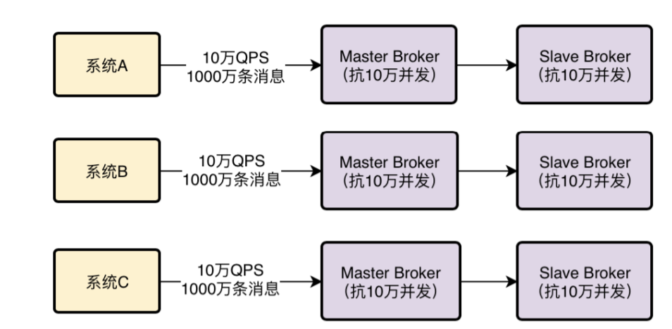

# gateway

## 文档地址
- https://cloud.spring.io/spring-cloud-static/spring-cloud-gateway/2.1.0.RELEASE/multi/multi_spring-cloud-gateway.html

## Springcloud通用配置

- Eureka server 配置
```
server.port=8761
eureka.instance.hostname=localhost
eureka.client.registerWithEureka=false
eureka.client.fetchRegistry=false
eureka.client.serviceUrl.defaultZone:http://${eureka.instance.hostname}:${server.port}/eureka/
```

- 服务配置
```
server.port=8760
spring.application.name=CLOUD-SERVICE
eureka.instance.hostname=localhost
eureka.client.registerWithEureka=true
eureka.client.fetchRegistry=true
eureka.client.serviceUrl.defaultZone:http://${eureka.instance.hostname}:8761/eureka/
```

- 网关配置
```
server.port=8088
spring.application.name=CLOUD-GATEWAY
eureka.instance.hostname=localhost
eureka.client.registerWithEureka=true
eureka.client.fetchRegistry=true
eureka.client.serviceUrl.defaultZone:http://${eureka.instance.hostname}:8761/eureka/
```

## 以服务名为前缀访问服务接口
- 在网关配置加入
```
spring.cloud.gateway.discovery.locator.enabled=true
```


## predicates断言路由
- 在网关配置中加入以下配置
```
spring.cloud.gateway.routes[0].id= 1
spring.cloud.gateway.routes[0].uri=http://localhost:8760
spring.cloud.gateway.routes[0].predicates[0]=Path=/demo/**
```


## 过滤器
- 加入以下配置
```
spring.cloud.gateway.routes[0].filters[0].name=AddRequestParameter
spring.cloud.gateway.routes[0].filters[0].args[name]=token
spring.cloud.gateway.routes[0].filters[0].args[value]=abcdef
```


## 过滤器对结果进行处理
- 对结果进行处理
- 官方文档提供的 modifyResponseBody过滤器


添加Java配置
```
@Bean
public RouteLocator routes(RouteLocatorBuilder builder,ObjectMapper mapper) {
return builder.routes()
.route("id2", r -> r.path("/modify/**")
.filters(gatewayFilterSpec-> {
gatewayFilterSpec.modifyResponseBody(String.class,String.class,(exchange,s) ->{
String result = s;
try{
Map map = mapper.readValue(s, Map.class);
map.put("add","this is modify");
result = mapper.writeValueAsString(map);
}catch (Exception e){
}
return  Mono.just(result); }
);
return gatewayFilterSpec;
}).uri(URI.create("http://localhost:8760"))).build();
}
```
结果


## 全局过滤器
### 自定义全局过滤器
```
@Bean
@Order(-1)
public GlobalFilter a() {
    return (exchange, chain) -> {
        if (exchange.getRequest().getQueryParams().containsKey("token")){
            return chain.filter(exchange).doOnSuccess(s->{
            exchange.getResponse().getHeaders().add("token",exchange.getRequest().getQueryParams().get("token").get(0));
        });
        }else{
            return chain.filter(exchange);
        }
    };
}
```
或者实现GlobalFilter、 Order接口


## 接入actuator
### 添加依赖
```
<dependency>
    <groupId>org.springframework.boot</groupId>
    <artifactId>spring-boot-starter-actuator</artifactId>
</dependency>
```
## 添加配置
```
management.endpoint.gateway.enabled=true
management.endpoints.web.exposure.include=gateway
```
## 访问地址
- /actuator/gateway/globalfilters
- /actuator/gateway/routefilters
- /actuator/gateway/refresh
- /actuator/gateway/routes
- /actuator/gateway/routes/{id}
- POST request to /gateway/routes/{id_route_to_create}
- DELETE request to /gateway/routes/{id_route_to_delete}.

### 自定义Filter
- 实现GatewayFilterFactory 或者继承AbstractGatewayFilterFactory
```
public class AddResponseHeaderGatewayFilterFactory extends AbstractNameValueGatewayFilterFactory {

@Override
public GatewayFilter apply(NameValueConfig config) {
return new GatewayFilter() {
@Override
public Mono<Void> filter(ServerWebExchange exchange, GatewayFilterChain chain) {
String value = ServerWebExchangeUtils.expand(exchange, config.getValue());
exchange.getResponse().getHeaders().add(config.getName(), value);

            return chain.filter(exchange);
         }

         @Override
         public String toString() {
            return filterToStringCreator(AddResponseHeaderGatewayFilterFactory.this)
                  .append(config.getName(), config.getValue()).toString();
         }
      };
}

}
```